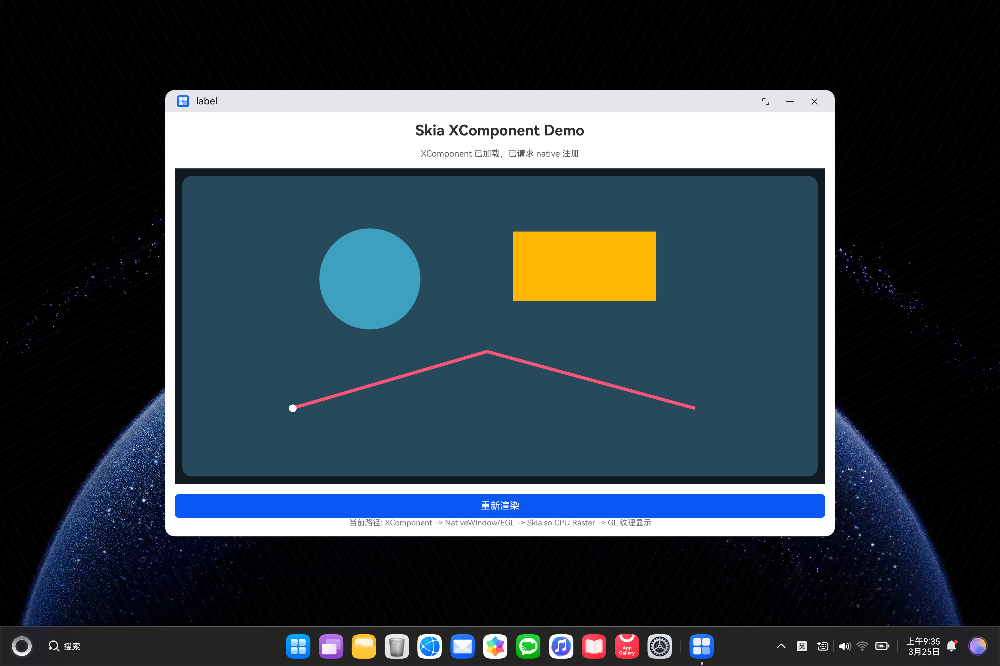
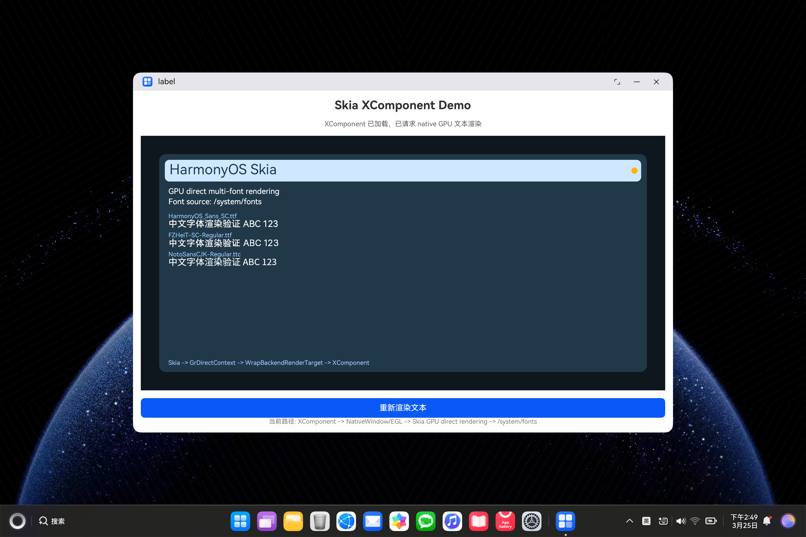

# skia_OHOS

最后更新：`2026-03-30`

## 修改日志

- `2026-03-30`
  - 清理历史叠加内容，统一为当前快照版本
  - 更新到 `Phase 4` 当前实际状态
  - 补充 native 工程化拆分后的代码结构
  - 补充调用链文档入口

`skia_OHOS` 是一个 HarmonyOS ArkTS 验证工程，用来验证 `Skia` 在 HarmonyOS 上的接入结果。

相关仓库：
- ArkTS 示例工程：`https://github.com/NormanFxxkingRockwell/skia_OHOS.git`
  当前分支：`main`
- Skia 适配仓库：`https://github.com/NormanFxxkingRockwell/skia.git`
  当前适配分支：`m146-ohos`
  基线分支：`chrome/m146`

记录日期：
- `2026-03-30`

## 当前结论

截至当前：
- `Phase 0` 已完成：基础 OHOS 化与最小构建验证
- `Phase 1` 已完成：ArkTS 工程接入与可见渲染验证
- `Phase 2` 已完成：GPU direct rendering 真机验证
- `Phase 3` 已完成：`freetype + harfbuzz + ICU + shaped text` 真机验证
- `Phase 4` 已进入源码级平台适配，当前重点在 `SkFontMgr_ohos`

最新里程碑：
- `SkFontMgr_ohos` 已从“目录扫描 / 手读配置”推进到“OHOS NativeDrawing 官方接口优先”
- 当前已经补上：
  - `bcp47` 语言感知 fallback
  - `groupName + familyName` 更细匹配
- 最新增强已完成 HAP 回归，没有打坏 `gpu_direct`
- `skia_OHOS` native 侧已完成第一轮工程化拆分，`napi_init.cpp` 不再承载全部渲染逻辑

## 阶段计划

- [x] Phase 0：基础 OHOS 化与最小构建验证
- [x] Phase 1：ArkTS 工程接入与可见渲染验证
- [x] Phase 2：GPU 直连渲染路径
- [x] Phase 3：文本与字体系统恢复
- [ ] Phase 4：OHOS 平台分支整理与稳定化
- [ ] Phase 5：更深层源码级平台适配

### Phase 4 当前进度

- [x] 4.1 整理 OHOS feature matrix 第一版
- [x] 4.2 梳理 OHOS 平台入口与边界第一版
- [x] 4.3 固化 `lycium -> smoke test -> HAP` 验证链第一版
- [x] 4.4 识别源码级平台适配点
- [x] 第一项源码级平台工作：
  `SkFontMgr_ohos`
- [x] `SkFontMgr_ohos` 已切到 `OHOS NativeDrawing` 官方接口优先
- [x] `SkFontMgr_ohos` 已补 `bcp47` 语言感知 fallback
- [x] `SkFontMgr_ohos` 已补 `groupName + familyName` 更细匹配
- [ ] 第二项源码级平台工作：
  `OHOS window / surface context`

## 当前效果

### Phase 2：GPU 直连渲染



说明：
- 当前渲染路径不是旧的“CPU 位图离屏后再贴纹理”
- 而是 `Skia` 直接通过 GPU 后端绘制到 `XComponent` 对应的渲染目标

### Phase 3：文本与多字体验证



说明：
- 当前已经完成中文文本显示
- 当前已经完成多字体样张验证
- 当前已经完成 `HarfBuzz + ICU` shaped text 路线验证

## 当前实现链路

当前 `skia_OHOS` 的真实调用链路是：

1. ArkTS 页面创建 `XComponent`
2. native 拿到 `OH_NativeXComponent` 和 `NativeWindow`
3. native 创建 `EGLDisplay / EGLContext / EGLSurface`
4. `Skia` 创建 `GrDirectContext`
5. 当前 framebuffer 被包装成 `GrBackendRenderTarget`
6. `Skia` 通过 `SkSurfaces::WrapBackendRenderTarget(...)` 得到 GPU `SkSurface`
7. `SkCanvas` 直接在 GPU `SkSurface` 上绘制
8. 文本部分通过 `HarfBuzz + ICU` shaping 生成 `SkTextBlob`
9. `flushAndSubmit(...)`
10. `eglSwapBuffers(...)`

当前看到的内容是：
- 图形内容由 `Skia` 绘制
- 文本内容由 `Skia + HarfBuzz + ICU` shaping 后绘制
- 屏幕显示由 `XComponent + NativeWindow + EGL/GLES` 承载

当前 native 代码结构已经拆分为：

- `napi_init.cpp`
  - 只负责 NAPI 模块注册与导出绑定
- `renderer/xcomponent_bridge.cpp`
  - 负责 `XComponent` 回调注册、surface 生命周期和桥接
- `renderer/skia_gpu_renderer.cpp`
  - 负责 `EGL`、`GrDirectContext`、`SkSurface` 和帧提交
- `renderer/skia_scene_renderer.cpp`
  - 负责字体准备、shaping 和实际场景绘制
- `renderer/renderer_state.h`
  - 负责共享渲染状态

## 当前适配点

### 1. 构建层适配

- 增加 `OHOS` 平台识别
- 在 `GN` 和 recipe 中引入 `skia_use_ohos`
- 剥离 Linux 桌面特性：
  - `x11`
  - `fontconfig`
  - `perfetto`
- 通过 `lycium` 固化 OHOS 主构建流程

### 2. GPU 路径适配

- 启用 `EGL/GLES`
- 跑通 `Ganesh + EGL/GLES`
- 在真机完成 `gpu_direct` 验证

### 3. 文本路径适配

- 恢复 `freetype`
- 恢复 `harfbuzz`
- 从 `bidi subset` 切换到 `ICU Unicode`
- 增加：
  - `ohos_text_smoke`
  - `ohos_shaper_smoke`
- 完成 shaped text 真机验证

### 4. 字体管理入口适配

- 新增 `SkFontMgr_ohos`
- 当前主路径已经是：
  `OHOS NativeDrawing 官方接口优先`
- 当前优先使用的官方接口包括：
  - `OH_Drawing_GetSystemFontConfigInfo`
  - `OH_Drawing_CreateFontParser`
  - `OH_Drawing_FontParserGetSystemFontList`
  - `OH_Drawing_FontParserGetFontByName`
- 当前又补上了：
  - `bcp47` 语言感知 fallback
  - `groupName + familyName` 更细匹配

当前含义：
- 系统字体目录、generic alias、fallback 信息优先来自平台接口
- `Skia` 继续使用自己的 `FreeType + HarfBuzz + ICU` 完成实际渲染
- 这已经进入 `Skia src/ports` 的源码级平台适配阶段

## 当前已实现

- `OHOS` 基础平台识别
- `lycium` 可构建 GPU + shaped text 版 `libskia.so`
- `ohos_egl_smoke`
- `ohos_text_smoke`
- `ohos_shaper_smoke`
- 真机 GPU 直连渲染验证
- 真机 shaped text 验证
- `skia_OHOS` HAP shaped text 接入
- `SkFontMgr_ohos`
- `NativeDrawing` 官方字体接口优先
- `bcp47` 语言感知 fallback
- `groupName + familyName` 更细匹配

## 当前未实现

- `SkFontMgr_ohos` 的更完整 fallback 策略
- `Skia` 本体中的正式 `OHOS window context / surface context`
- `src/ports` 层的 OHOS 原生 buffer / image bridge
- `OHOS` 专用 logging / debug / OS glue
- Vulkan / Graphite 的 OHOS 路线

## 最新验证结果

### 最新 smoke 结果

```text
font_families=235
alias_harmonyos_sans=1
alias_serif=1
fallback_cjk=1
fallback_arabic_lang=1
fallback_tibetan_lang=1
pixel_checksum=18319541926308614285
```

### 最新 HAP 回归结果

```text
OnSurfaceCreated
surface created size=2030x986 ready=1
RenderFrame finished frame=0 mode=gpu_direct
RenderFrame finished frame=1 mode=gpu_direct
```

说明：
- 最新字体管理增强没有破坏 `gpu_direct`
- `skia_OHOS` 仍然可以作为当前 Phase 4 的应用侧验证工程

## 相关报告

- [adaptation-plan.md](docs/reports/adaptation-plan.md)
- [deep-analysis-report.md](docs/reports/deep-analysis-report.md)
- [deep-adaptation-progress.md](docs/reports/deep-adaptation-progress.md)
- [phase4-feature-matrix.md](docs/reports/phase4-feature-matrix.md)
- [phase4-platform-boundary.md](docs/reports/phase4-platform-boundary.md)
- [phase4-validation-chain.md](docs/reports/phase4-validation-chain.md)
- [phase5-candidate-modules.md](docs/reports/phase5-candidate-modules.md)
- [skia-render-call-chain.md](docs/skia-render-call-chain.md)

## 下一步

当前最合理的下一步是：
- 进入第二项源码级平台工作：
  `OHOS window / surface context`

也就是把现在主要由 `skia_OHOS` 应用侧承接的：
- `XComponent`
- `NativeWindow`
- `EGLSurface / lifecycle`

进一步梳理成 `Skia` 本体里更正式的 OHOS 平台入口。
